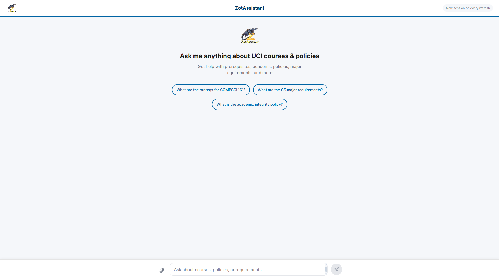
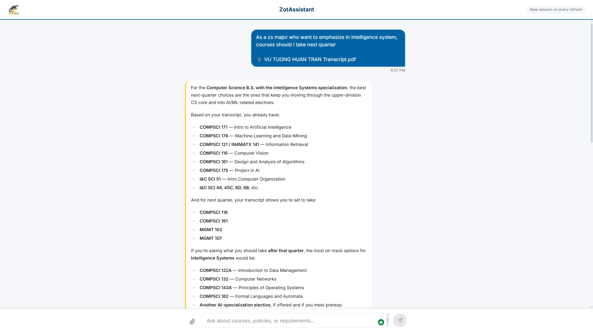
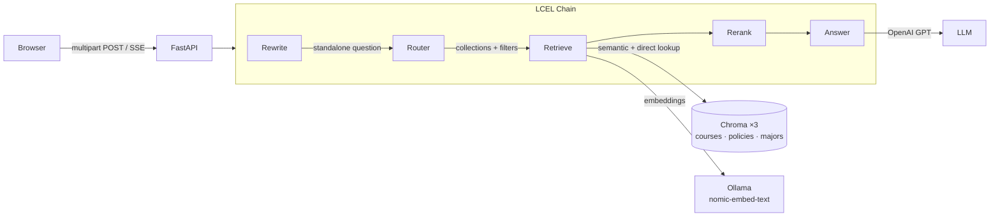

# ZotAssistant — UCI Policy & Course RAG Chatbot

<p align="center">
  
</p>

<p align="center">
  A conversational assistant that helps UCI students pick courses, understand prerequisites, and navigate academic policies — grounded in the UCI catalogue via retrieval-augmented generation.
</p>

<p align="center">
  
  
  
  
  
</p>

---

## Demo



<!-- TODO: GIF (optional) — docs/screenshots/file-upload.gif -->

---

## Features

- **Hybrid retrieval** — direct course-code lookup by metadata filter + semantic similarity search, so specific codes like `COMPSCI 161` are always found reliably.
- **Router-driven collection selection** — an LLM router decides which Chroma collections (courses, policies, majors) to query per question, avoiding irrelevant results.
- **Cross-encoder reranking** — FlashRank re-scores candidates locally (no API key) before the answer is generated.
- **Multi-collection Chroma** — three separate vector DBs: course catalog, student-facing policies, and school major/minor pages.
- **Conversational memory** — sliding window of 6 exchanges; user questions are rewritten into standalone queries to handle pronouns and follow-ups.
- **File uploads** — paste a syllabus or advising sheet (`.pdf`, `.docx`, `.txt`) and ask questions about it. OCR fallback handles scanned PDFs.
- **Streaming SSE UI** — answers stream token-by-token in the browser; no waiting for the full response.
- **Layered evaluation harness** — six harnesses covering router accuracy, retrieval recall, end-to-end faithfulness, multi-turn polarity, file upload, and latency.

---

## Architecture

<!-- TODO: architecture diagram — docs/architecture.png -->



> Replace the comment above with `` once you've exported the diagram.

---

## Tech Stack

| Layer | Technologies |
|---|---|
| **Backend** | Python 3.10.10, FastAPI, LangChain, ChromaDB, FlashRank, Ollama (`nomic-embed-text`), OpenAI API, pdfplumber, pytesseract |
| **Frontend** | React 18, Vite 6, Tailwind CSS 4, shadcn/ui (Radix UI), react-markdown, pnpm |
| **Crawling** | requests, BeautifulSoup4, pdfplumber |
| **Evaluation** | Custom harnesses: router · retrieval · E2E · multiturn · file · perf |

---

## Data Scale

All data is sourced from UCI's public websites. `data/raw/` is gitignored (rebuild with the crawler). `data/db/` is tracked via **Git LFS**.

| Collection | Raw JSON files | Vector DB size | Coverage |
|---|---|---|---|
| courses   | 235  | 65 MB  | ~5,920 courses across 118 departments |
| majors    | 776  | 168 MB | 18 UCI schools / divisions |
| policies  | 526  | 74 MB  | Student-facing policies only |

---

## Prerequisites

| Dependency | Notes |
|---|---|
| Python 3.10.10 | Other 3.10.x may work; 3.11+ untested |
| Node 18+ with pnpm | `npm install -g pnpm` |
| [Ollama](https://ollama.com) | Must be running; pull `nomic-embed-text` |
| OpenAI API key | GPT-4o / GPT-4o-mini used for LLM calls |
| Git LFS | Required to check out the Chroma DBs |
| Tesseract OCR *(optional)* | For scanned-PDF uploads only — install via `winget install UB-Mannheim.TesseractOCR` |

---

## Quick Start

The databases are already built and stored in Git LFS. This gets you from clone to a running chatbot in ~5 minutes.

```bash
# 1. Clone (LFS must be installed first)
git lfs install
git clone <repo-url>
cd Policy-and-Course-Assistant-RAG-Chatbot

# 2. Python environment
python -m venv .venv
.venv\Scripts\activate          # Windows
# source .venv/bin/activate     # macOS / Linux
pip install -r requirements.txt

# 3. Environment variables
cp .env.example .env
# Open .env and fill in OPENAI_API_KEY

# 4. Start Ollama (separate terminal)
ollama pull nomic-embed-text
ollama serve

# 5. Build the frontend (one-time)
cd frontend && pnpm install && pnpm build && cd ..

# 6. Run the app
python -m rag_chatbot.app
# → http://localhost:7860
```

For frontend hot-reload during development, run the backend and Vite dev server in parallel:

```bash
# Terminal 1
python -m rag_chatbot.app

# Terminal 2
cd frontend && pnpm dev     # → http://localhost:5173 (proxies /api/* to :7860)
```

---

## Full Setup — Rebuilding the Knowledge Base

Run this if you want to re-crawl from UCI's live websites or add new schools/policies. See `CLAUDE.md` for the full CLI reference with all options.

**1. Crawl**

```bash
# Course catalog (~235 files, covers all departments)
python crawler/crawler.py https://catalogue.uci.edu/allcourses --type course_catalog

# Student-facing policies (run each source separately)
python crawler/crawler.py https://catalogue.uci.edu/informationforadmittedstudents --type policy --output data/raw/policies
python crawler/crawler.py https://conduct.uci.edu --type policy --output data/raw/policies
python crawler/crawler.py https://www.reg.uci.edu/enrollment --type policy --output data/raw/policies
python crawler/crawler.py https://www.reg.uci.edu/grades --type policy --output data/raw/policies

# Majors — one command per school (do NOT start from catalogue root)
python crawler/crawler.py https://catalogue.uci.edu/donaldbrenschoolofinformationandcomputersciences --type policy --output data/raw/majors
python crawler/crawler.py https://catalogue.uci.edu/schoolofengineering --type policy --output data/raw/majors
# Repeat for each school...
```

> **Do not** crawl `policies.uci.edu` or `ap.uci.edu` — those are staff/HR sites and will pollute retrieval results.

**2. Ingest into Chroma**

```bash
python ingest/ingest.py --source data/raw/courses  --collection courses  --db-path data/db/courses
python ingest/ingest.py --source data/raw/policies --collection policies --db-path data/db/policies
python ingest/ingest.py --source data/raw/majors   --collection majors   --db-path data/db/majors
```

Ingest is idempotent (`upsert`) — safe to re-run after adding new files.

---

## Project Structure

```
crawler/        BFS web + PDF crawler (course catalog & policy sites)
ingest/         Chunks JSON → Chroma via Ollama embeddings
rag_chatbot/    FastAPI app + LCEL chain + retriever + memory + file parser
  app.py          API server (SSE streaming, file upload endpoint)
  chain.py        LCEL pipeline: rewrite → route → retrieve → answer
  retriever.py    Hybrid retrieval: direct lookup + semantic + reranking
  memory.py       Sliding-window message history (swap for Redis here)
  file_parser.py  PDF / DOCX / TXT extraction with OCR fallback
frontend/       Vite + React + Tailwind + shadcn/ui chat interface
eval/           Evaluation harnesses and datasets
  run_all.py      Entry point for all harnesses
  harnesses/      router · retrieval · e2e · multiturn · file · perf
  datasets/       Auto-generated + hand-curated test cases
data/raw/       Crawled JSON (gitignored — rebuild with crawler)
data/db/        Chroma collections (Git LFS — pull or rebuild with ingest)
diagnose.py     Standalone script to inspect Chroma collections directly
```

---

## Evaluation

Six harnesses cover the full pipeline. Run from the project root with the venv active.

```bash
python eval/run_all.py --harness router    --dataset hard    --limit 20
python eval/run_all.py --harness retrieval --dataset courses --limit 50
python eval/run_all.py --harness e2e       --dataset hard    --limit 10 --judge
python eval/run_all.py --harness perf      --limit 20

# Multi-turn and polarity tests
pytest eval/harnesses/multiturn_eval.py -v

# Diff the two most recent runs
python eval/report.py
```

| Harness | Needs Chroma | Key metric |
|---|---|---|
| `router` | No | Collection F1, `requires_full_requirements` accuracy |
| `retrieval` | Yes | Recall@1/3/10, MRR, direct-lookup hit rate |
| `e2e` | Yes | Citation accuracy, LLM judge faithfulness/relevance (1–5) |
| `multiturn` | Yes | Polarity preservation, pronoun resolution |
| `file` | Yes | `[User-Attached Document]` block present in context |
| `perf` | Yes | Latency p50/p95, tokens/query, cost/query |

Results land in `eval/runs/<timestamp>/` (gitignored).

---

## Configuration

**`.env` variables:**

| Variable | Default | Description |
|---|---|---|
| `OPENAI_API_KEY` | *(required)* | Used for all LLM calls (rewriter, router, answer) |
| `OLLAMA_URL` | `http://localhost:11434/api/embeddings` | Ollama embedding endpoint |
| `OLLAMA_MODEL` | `nomic-embed-text` | Embedding model name |

**Retrieval tuning (`rag_chatbot/retriever.py`):**

- `_DB_CONFIG` — per-collection k values and DB paths.
- `_DEPT_ALIASES` — maps student shorthand (`CS`, `ICS`) to catalog codes (`COMPSCI`, `I&C SCI`). Add aliases here when a department is not being found.

---

## Troubleshooting

| Symptom | Fix |
|---|---|
| `ConnectionRefusedError` on startup | Start Ollama: `ollama serve` |
| Chroma collections are empty | Git LFS files not pulled — run `git lfs pull`, or rebuild with ingest |
| OCR not working for scanned PDFs | Install Tesseract: `winget install UB-Mannheim.TesseractOCR` |
| Vite dev server returns 404 on `/api/*` | Both `python -m rag_chatbot.app` AND `pnpm dev` must be running simultaneously |

---

## Limitations / Roadmap

- Chroma does not support graph-style relationships — prerequisite chains cannot be traversed programmatically.
- Scanned/image-based PDFs are silently skipped by the crawler (only the file-upload path handles them via OCR).
- Sessions are in-memory only — conversations reset on server restart. Swap `InMemoryChatMessageHistory` in `rag_chatbot/memory.py` for Redis or SQLite to persist.
- No CI pipeline is configured yet.

---

## Acknowledgements

- [UCI Course Catalogue](https://catalogue.uci.edu) — source of all course and major data
- [LangChain](https://github.com/langchain-ai/langchain), [ChromaDB](https://www.trychroma.com), [Ollama](https://ollama.com), [FlashRank](https://github.com/PrithivirajDamodaran/FlashRank)
